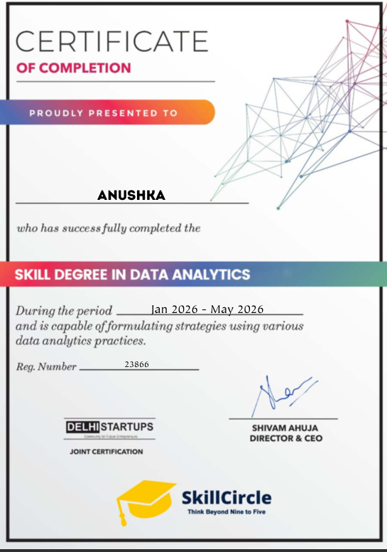
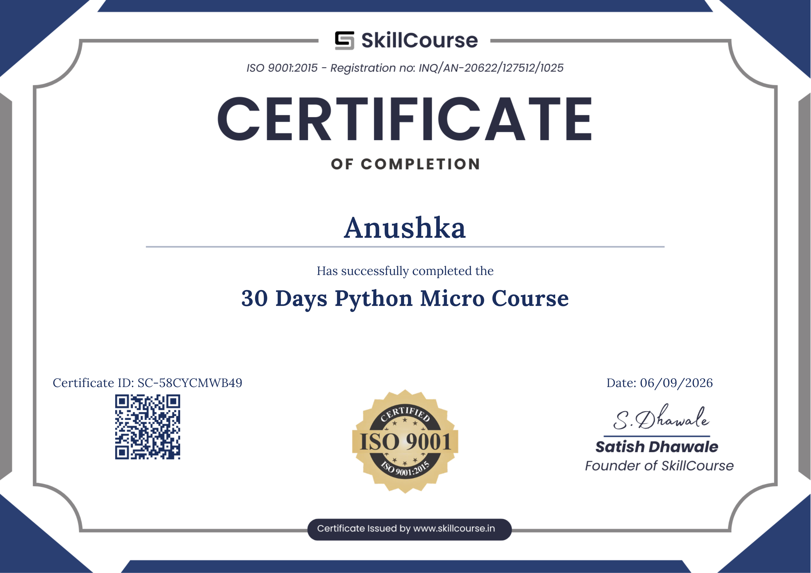
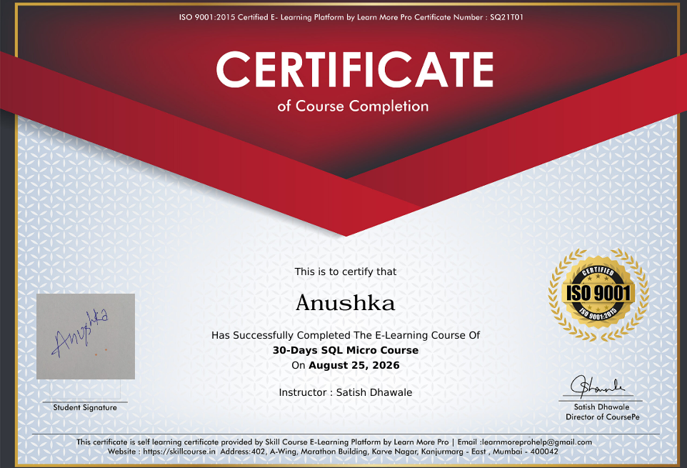
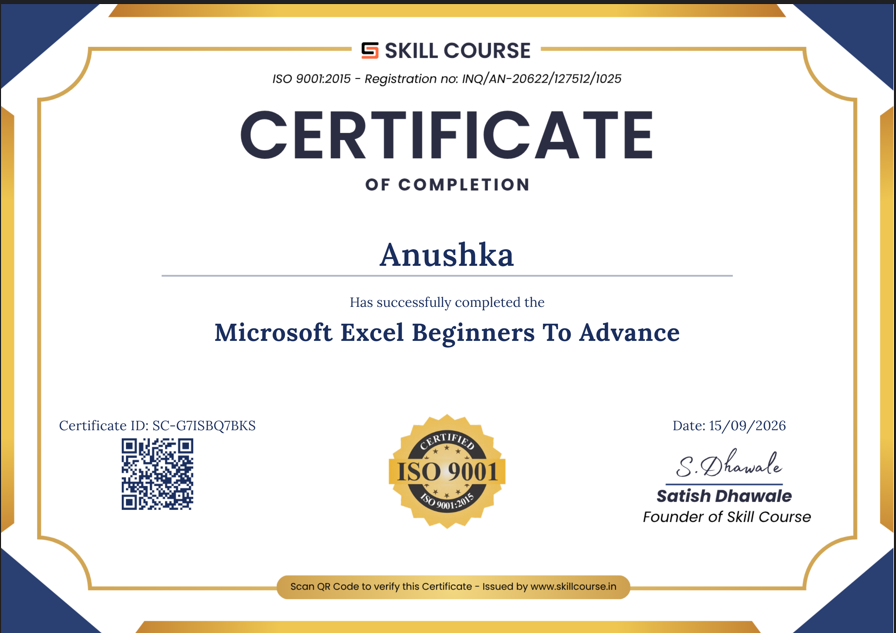

# 👋 Hi, I'm Anushka

### 📊 Aspiring Data Analyst

I'm an aspiring Data Analyst with a strong interest in data analysis, visualization, and problem-solving.

I enjoy working with data, exploring patterns, and turning data into meaningful insights.

---

## 🛠️ Skills

**Programming & Data Analysis**
- 🐍 Python
- 🐼 Pandas
- 🔢 NumPy

**Database**
- 🗄️ SQL

**Tools & Visualization**
- 📊 Microsoft Excel
- 📈 Power BI
- 📉 Seaborn

---

## 📜 Certificates

###🏆 Skill Degree in Data Analytics

### 🏆 30 Days Power BI Micro Course

### 🐍 30 Days Python Micro Course

### 🗄️ 30-Days SQL Micro Course

### 🏆 Microsoft Excel Beginners to Advance

---

## 📫 Connect With Me

📧 **Email:** baberwalanushka05@gmaiil.com

💼 **LinkedIn:** [Connect with me](www.linkedin.com/in/anushka-baberwal-609b90428)

🐙 **GitHub:** [@baberwalanushka](https://github.com/baberwalanushka)

---

### ✨ Always Learning • Always Improving • Always Exploring Data
